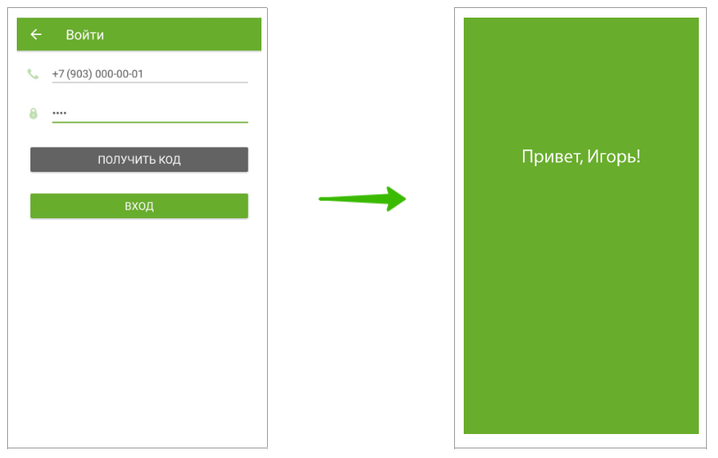
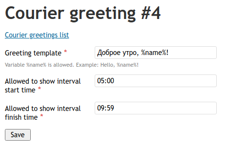
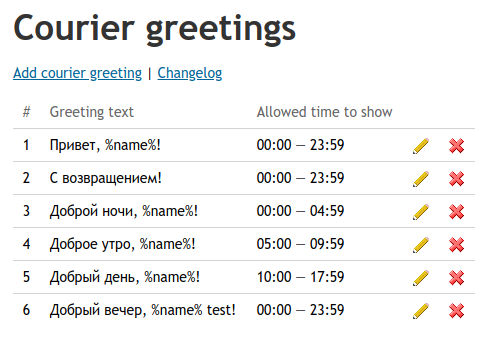

# Borzo Backend Code Sample

Давайте по шагам разберём на простой задаче, как мы создаём новые фичи в Борзо (aka Достависте).

Код здесь только ради примера, его не получится запустить, но его можно почитать.

**Да, и приходите работать к нам! У нас интересно.**
<br>🔥 [Наши вакансии на HeadHunter](https://hh.ru/employer/3730831).


## Задача

В курьерском мобильном приложении требуется сделать ежедневное приветствие курьера.

Как это будет работать: курьер первый раз за день открывает приложение и несколько секунд видит приветствие.



1. Текст приветствия каждый раз случайный.<br>
   Примеры: «Привет, Игорь», «Доброе утро, Андрей!», «Буэнос диас, амиго!».
2. Некоторые варианты («Доброе утро», «Добрый вечер») можно показывать только в определенный интервал времени.<br>
   Например, «Доброе утро» пишем только с 5:00 до 10:00.
3. Список возможных вариантов приветствий и время для их показа можно настраивать в админке.


## Миграции

Чтобы хранить возможные варианты приветствий, создадим таблицу `courier_greetings` в базе данных.
<br>Для этого добавим новый файл с миграцией в директории [migrations](https://github.com/27cm/backend-code-sample/tree/master/migrations). 

**[migrations/2021-10-30_12-01_create_table_courier_greetings.php](https://github.com/27cm/backend-code-sample/blob/master/migrations/2021-10-30_12-01_create_table_courier_greetings.php)**

```php
<?php

use Dostavista\Framework\Database\Migrations\CreateTableMysqlMigrationAbstract;

return new class() extends CreateTableMysqlMigrationAbstract {
    protected function getCreateTableSql(): string {
        return "
            CREATE TABLE courier_greetings (
                courier_greeting_id INT UNSIGNED NOT NULL PRIMARY KEY AUTO_INCREMENT COMMENT 'Идентификатор приветствия курьера',
                greeting_template VARCHAR(1024) NOT NULL COMMENT 'Шаблон с текстом приветствия',
                allowed_to_show_start_time TIME NOT NULL DEFAULT '00:00:00' COMMENT 'Допустимое время начала показа приветствия',
                allowed_to_show_finish_time TIME NOT NULL DEFAULT '23:59:59' COMMENT 'Допустимое время окончания показа приветствия',
                is_deleted TINYINT UNSIGNED NOT NULL DEFAULT 0 COMMENT 'Удалена ли запись',
                INDEX idx_allowed_to_show_time (allowed_to_show_start_time, allowed_to_show_finish_time)
            ) ENGINE=InnoDB DEFAULT CHARSET=utf8mb4 COLLATE=utf8mb4_unicode_ci COMMENT='Личные приветствия курьеров в мобильных приложениях';
        ";
    }
};
```

В отдельной миграции наполним нашу таблицу данными.

**[migrations/2021-10-30_12-02_insert_courier_greetings_data.php](https://github.com/27cm/backend-code-sample/blob/master/migrations/2021-10-30_12-02_insert_courier_greetings_data.php)**

```php
<?php

use Dostavista\Core\Super;
use Dostavista\Framework\Database\Migrations\MysqlMigrationAbstract;

return new class() extends MysqlMigrationAbstract {
    /**
     * @return string[]
     */
    public function getChangedTables(): array {
        return ['courier_greetings'];
    }

    protected function execute(): void {
        if (Super::getConfig()->isRussia()) {
            Super::getDb()->query("
                INSERT INTO courier_greetings
                    (greeting_template, allowed_to_show_start_time, allowed_to_show_finish_time)
                VALUES 
                    ('Привет, %name%!', '00:00:00', '23:59:59'),
                    ('С возвращением!', '00:00:00', '23:59:59'),
                    ('Доброй ночи, %name%!', '00:00:00', '04:59:59'),
                    ('Доброе утро, %name%!', '05:00:00', '09:59:59'),
                    ('Добрый день, %name%!', '10:00:00', '17:59:59'),
                    ('Добрый вечер, %name%!', '18:00:00', '23:59:59')
            ");
        } else {
            Super::getDb()->query("
                INSERT INTO courier_greetings
                    (greeting_template, allowed_to_show_start_time, allowed_to_show_finish_time)
                VALUES 
                    ('Hello, %name%!', '00:00:00', '23:59:59'),
                    ('Welcome back!', '00:00:00', '23:59:59'),
                    ('Good night %name%!', '00:00:00', '04:59:59'),
                    ('Good morning %name%!', '05:00:00', '09:59:59'),
                    ('Good afternoon %name%!', '10:00:00', '17:59:59'),
                    ('Good evening %name%!', '18:00:00', '23:59:59')
            ");
        }
    }
};
```

> ☝️ **Примечание**<br>
> На самом деле в боевом проекте мы не делаем это вручную, а используем специальный консольный скрипт, создающий файлы с миграциями.


## Директория с файлами фичи

Мы не смешиваем весь код в одну кучу, и стараемся аккуратно раскладывать фичи по отдельным папочкам.

Поэтому для нашей новой фичи создадим директорию [library/Dostavista/Features/CourierGreetings](https://github.com/27cm/backend-code-sample/tree/master/library/Dostavista/Features/CourierGreetings).

Все классы и файлы, относящиеся к этой фиче, будем создавать в этой директории.


## Классы для работы с таблицей

Чтобы работать с новой таблицей, нужно создать два класса: `CourierGreetingRow` и `CourierGreetingsTable`.

**[library/Dostavista/Features/CourierGreetings/CourierGreetingsTable.php](https://github.com/27cm/backend-code-sample/blob/master/library/Dostavista/Features/CourierGreetings/CourierGreetingsTable.php)**

```php
<?php

namespace Dostavista\Features\CourierGreetings;

use Dostavista\Framework\Database\TableAbstract;

/**
 * Таблица с личными приветствиями курьеров в мобильных приложениях.
 *
 * @method static CourierGreetingRow|null getRow(array $where = [], string[] $order = [], int|null $offset = null)
 * @method static CourierGreetingRow|null getRowById(int|null $id)
 * @method static CourierGreetingRow|null getRowFromSql(string $sql, array $params = [])
 * @method static CourierGreetingRow|null getRowByForeignKey(string $fieldName, int $foreignKeyId)
 * @method static CourierGreetingRow requireRowById(int $id, string|null $errorMessage = null)
 * @method static CourierGreetingRow getOrCreateRowById(int $id)
 * @method static CourierGreetingRow getOrMakeUnsavedRowById(int $id)
 * @method static CourierGreetingRow makeUnsavedRow()
 * @method static CourierGreetingRow createFromArray(array $data = [])
 * @method static CourierGreetingRow[] getRowset(array $where = [], string[] $order = [], int|null $count = null, int|null $offset = null)
 * @method static CourierGreetingRow[] getRowsetByIds(int[] $ids, string[] $order = [], int|null $count = null, int|null $offset = null)
 * @method static CourierGreetingRow[] getRowsetFromSql(string $sql, array $params = [])
 * @method static CourierGreetingRow[] getRowsetByForeignKeys(string $fieldName, int[] $foreignKeyIds)
 * @method static CourierGreetingRow[] warmupGetRowByIdCache(int[] $ids)
 * @method static CourierGreetingRow[] warmupGetRowsetByForeignKeysCache(string $fieldName, int[] $foreignKeyIds)
 */
class CourierGreetingsTable extends TableAbstract {
    public static function getTableName(): string {
        return 'courier_greetings';
    }

    public static function getRowClass(): string {
        return CourierGreetingRow::class;
    }
}
```

**[library/Dostavista/Features/CourierGreetings/CourierGreetingRow.php](https://github.com/27cm/backend-code-sample/blob/master/library/Dostavista/Features/CourierGreetings/CourierGreetingRow.php)**

```php
<?php

namespace Dostavista\Features\CourierGreetings;

use Dostavista\Core\Changelogs\ChangelogTable;
use Dostavista\Framework\Database\TableRowAbstract;

/**
 * Личное приветствие курьеров в мобильных приложениях.
 *
 * @property int    $courier_greeting_id         Идентификатор приветствия курьера.
 * @property string $greeting_template           Шаблон с текстом приветствия.
 * @property string $allowed_to_show_start_time  Допустимое время начала показа приветствия.
 * @property string $allowed_to_show_finish_time Допустимое время окончания показа приветствия.
 */
class CourierGreetingRow extends TableRowAbstract {
}
```


Теперь в любом месте кода можно получить данные из базы.
Например, с помощью вызова метода `CourierGreetingsTable::getRowById(1)` можно получить приветствие с ID = 1.

> ☝️ **Примечание**<br>
> На самом деле в боевом проекте у нас есть консольный скрипт, создающий все эти файлы автоматически.


## CRUD в админке

Создадим простой [CRUD](https://ru.wikipedia.org/wiki/CRUD) в админке,
чтобы можно было добавлять, редактировать и удалять варианты приветствий.
Для этого нам понадобится сделать форму и контроллер.

Создадим форму:

**[library/Dostavista/Features/CourierGreetings/CourierGreetingForm.php](https://github.com/27cm/backend-code-sample/blob/master/library/Dostavista/Features/CourierGreetings/CourierGreetingForm.php)**

```php
<?php

namespace Dostavista\Features\CourierGreetings;

// ...

class CourierGreetingForm extends FormAbstract {
    public function init(): void {
        parent::init();

        // Шаблон с текстом приветствия
        $this->addText('greeting_template', [
            'label'       => 'Greeting template',
            'description' => 'Variable %name% is allowed. Example: Hello, %name%!',
            'required'    => true,
            'maxlength'   => 1024,
            'filters'     => [
                new StringTrimFilter(),
                new StripTagsFilter(),
            ],
            'validators' => [new StringLengthValidator(1, 1024)],
        ]);

        // Допустимое время начала показа приветствия
        $this->addText('allowed_to_show_start_time', [
            'label'      => 'Allowed to show interval start time',
            'value'      => '00:00:00',
            'class'      => 'js-input-time',
            'required'   => true,
            'filters'    => [new DateTimeFilter(null, 'H:i')],
            'validators' => [new TimeValidator()],
        ]);

        // Допустимое время окончания показа приветствия
        $this->addText('allowed_to_show_finish_time', [
            'label'      => 'Allowed to show interval finish time',
            'value'      => '23:59:59',
            'class'      => 'js-input-time',
            'required'   => true,
            'filters'    => [new DateTimeFilter(null, 'H:i')],
            'validators' => [new TimeValidator()],
        ]);

        $this->addSubmit('Save');
    }

    public function setCourierGreetingData(CourierGreetingRow $greeting): void {
        $values = $this->getValuesMapped();

        $greeting->greeting_template           = $values['greeting_template'];
        $greeting->allowed_to_show_start_time  = $values['allowed_to_show_start_time'];
        $greeting->allowed_to_show_finish_time = $values['allowed_to_show_finish_time'];
    }
}
```

Форма позволит создавать и редактировать приветствия. Вот так это будет выглядеть в админке:



Теперь создадим контроллер и разрешим к нему доступ только сотрудникам с правами `Permissions::PERM_GROUP_CONTENT_MANAGER`:

**[library/Dostavista/Features/CourierGreetings/CourierGreetingsDispatcherController.php](https://github.com/27cm/backend-code-sample/blob/master/library/Dostavista/Features/CourierGreetings/CourierGreetingsDispatcherController.php)**

```php
<?php

namespace Dostavista\Features\CourierGreetings;

// ...

/**
 * Контроллер для страницы с приветствиями курьеров в админке.
 */
class CourierGreetingsDispatcherController extends DispatcherControllerAbstract {
    public static function isActionPermitted(string $action, ?EmployeeRow $user = null): bool {
        return Permissions::hasAccess(Permissions::PERM_GROUP_CONTENT_MANAGER, $user);
    }

    /**
     * Список приветствий курьеров.
     */
    public function indexAction(): CourierGreetingsIndexView {
        $view = new CourierGreetingsIndexView();

        $view->greetings = CourierGreetingsTable::getRowset(['is_deleted = 0'], ['courier_greeting_id']);

        return $view;
    }

    /**
     * Добавление нового приветствия для курьеров.
     */
    public function addAction(): ViewAbstract {
        $form = new CourierGreetingForm();

        if ($this->getRequest()->isPost() && $form->isValid($this->getRequest()->getPost())) {
            $greeting = CourierGreetingsTable::makeUnsavedRow();
            $form->setCourierGreetingData($greeting);
            $greeting->save();

            FlashMessagesTable::addFlashMessage("New courier greeting #{$greeting->courier_greeting_id} was created");
            return RedirectView::createInternalRedirect('/dispatcher/courier-greetings');
        }

        $view = new CourierGreetingsAddView();

        $view->form = $form;

        return $view;
    }

    /**
     * Редактирование приветствия для курьеров.
     */
    public function editAction(): ViewAbstract {
        $greetingId = (int) $this->getRequest()->getParam('id');

        $greeting = CourierGreetingsTable::getRowById($greetingId);
        if (!$greeting) {
            FlashMessagesTable::addFlashMessage("Error! Courier greeting #{$greetingId} not found");
            return RedirectView::createInternalRedirect($this->getRequest()->getReferer(), '/dispatcher/courier-greetings');
        }

        $form = new CourierGreetingForm();
        $form->setDefaults($greeting->toArray());

        if ($this->getRequest()->isPost() && $form->isValid($this->getRequest()->getPost())) {
            $form->setCourierGreetingData($greeting);
            $greeting->save();

            FlashMessagesTable::addFlashMessage("Courier greeting #{$greetingId} was changed");
            return RedirectView::createInternalRedirect('/dispatcher/courier-greetings');
        }

        $view = new CourierGreetingsEditView();

        $view->greeting = $greeting;
        $view->form     = $form;

        return $view;
    }

    /**
     * Удаление приветствия для курьеров.
     */
    public function deleteAction(): ViewAbstract {
        $this->requirePost();

        $greetingId = (int) $this->getRequest()->getParam('id');

        $greeting = CourierGreetingsTable::getRowById($greetingId);
        if (!$greeting) {
            FlashMessagesTable::addFlashMessage("Error! Courier greeting #{$greetingId} not found");
            return RedirectView::createInternalRedirect($this->getRequest()->getReferer(), '/dispatcher/courier-greetings');
        }

        $greeting->is_deleted = true;
        $greeting->save();

        FlashMessagesTable::addFlashMessage("Courier greeting #{$greetingId} was deleted");
        return RedirectView::createInternalRedirect($this->getRequest()->getReferer(), '/dispatcher/courier-greetings');
    }
}
```

Получим вот такую страницу в админке:



> ☝️ **Примечание**<br>
> На самом деле в боевом проекте у нас есть консольный скрипт, создающий все эти файлы автоматически.


## Бизнес-логика

Самое время описать бизнес-логику нашей новой фичи. Так как тут у нас логика очень простая,
то создадим метод прямо в классе `CourierGreetingsTable`. Мы часто так делаем, чтобы не создавать абстракций на вырост.
Когда логика станет сильно сложнее, только в этот момент мы выделяем её в отдельный класс `CourierGreetingManager`.

Также не забываем, что наши курьеры работают в разных часовых поясах, поэтому вычисляем местное время в регионе курьера.

**[library/Dostavista/Features/CourierGreetings/CourierGreetingsTable.php](https://github.com/27cm/backend-code-sample/blob/master/library/Dostavista/Features/CourierGreetings/CourierGreetingsTable.php)**

```php
<?php

namespace Dostavista\Features\CourierGreetings;

// ...

class CourierGreetingsTable extends TableAbstract {
    /**
     * Возвращает текст случайного сообщения для курьера.
     */
    public static function getRandomGreetingMessage(CourierRow $courier): ?string {
        // Определяем местное время в регионе курьера
        $region    = $courier->getRegion();
        $localTime = $region->getLocalDateTime();

        // Выбираем все подходящие приветствия
        $greetings = [];
        foreach (static::getRowset(['is_deleted = 0']) as $greeting) {
            $startTime  = $region->getLocalDateTime($greeting->allowed_to_show_start_time);
            $finishTime = $region->getLocalDateTime($greeting->allowed_to_show_finish_time);
            if ($startTime <= $localTime && $localTime <= $finishTime) {
                $greetings[] = $greeting;
            }
        }

        if (empty($greetings)) {
            return null;
        }

        // Подставляем имя курьера в шаблон
        $greeting = $greetings[array_rand($greetings)];
        return str_ireplace('%name%', $courier->user_name, $greeting->greeting_template);
    }
}
```


## API

Чтобы мобильные приложения смогли получить текст приветствия, добавим новый метод в Courier API:

**[library/Dostavista/Features/CourierApi/CourierApiController.php](https://github.com/27cm/backend-code-sample/blob/master/library/Dostavista/Features/CourierApi/CourierApiController.php#L251-L263)**

```php
<?php

namespace Dostavista\Features\CourierApi;

// ...

class CourierApiController extends ModernApiControllerAbstract {
    /**
     * Возвращает случайно выбранное приветствие для авторизованного курьера.
     */
    public function randomGreetingAction(): JsonView {
        $this->requireGet();
        $courier = $this->requireAuthCourier();

        $greetingText = CourierGreetingsTable::getRandomGreetingMessage($courier);

        return $this->makeResponse([
            'greeting_text' => TypeCaster::stringOrNull($greetingText),
        ]);
    }
    
    // ...
}
```

Теперь приложения смогут обратиться к этому методу с авторизованной сессией курьера и получить случайное приветствие.

> ☝️ **Примечание**<br>
> У нас в разработке есть API Design Guidelines, которым мы следуем, чтобы создавать хорошее API.


## API Schema

Чтобы у мобильных разработчиков была документация, добавим новый метод в схему API.
Для этого создадим следующий файл:

**[library/Dostavista/Features/CourierApi/api-schema/methods/random-greeting.php](https://github.com/27cm/backend-code-sample/blob/master/library/Dostavista/Features/CourierApi/api-schema/methods/random-greeting.php)**

```php
<?php

use Dostavista\Features\CourierApi\CourierApiController;
use Dostavista\Framework\ApiSchema\ApiDoc;

return [
    'title'       => 'Приветствие',
    'description' => 'Возвращает случайно выбранное приветствие для курьера',

    /** @see CourierApiController::randomGreetingAction() */
    'path'          => '/random-greeting',
    'http_method'   => ApiDoc::GET,
    'auth_required' => true,

    'parameters' => [],

    'response' => [
        'properties' => [
            'greeting_text' => [
                'description' => 'Текст приветствия',
                'type'        => ApiDoc::STRING,
                'nullable'    => true,
                'example'     => 'Привет, Игорь!',
            ],
        ],
    ],
];
```

Теперь в курьерской документации появится [новая страница](https://raw.githubusercontent.com/27cm/backend-code-sample/master/.github/api-doc.png) с описанием метода API.


## Тесты

Чтобы из тестов можно было вызывать новый метод Courier API, добавим его в `CourierApiHelper`.

**[tests/Dostavista/TestUtils/Api/CourierApiHelper.php](https://github.com/27cm/backend-code-sample/blob/master/tests/Dostavista/TestUtils/Api/CourierApiHelper.php#L54-L66)**

```php
<?php

namespace Dostavista\TestUtils\Api;

// ...

class CourierApiHelper {
    /**
     * @see CourierApiController::randomGreetingAction()
     */
    public function getRandomGreeting(?CourierRow $courier = null): ModernApiClient {
        return $this->buildGetRequest('random-greeting', $courier);
    }
}
```

Теперь напишем пару тестов на новый метод Courier API. Создадим новый класс `CourierApiRandomGreetingTest`.

**[tests/Dostavista/Tests/CourierApi/CourierApiRandomGreetingTest.php](https://github.com/27cm/backend-code-sample/blob/master/tests/Dostavista/Tests/CourierApi/CourierApiRandomGreetingTest.php)**

```php
<?php

namespace Dostavista\Tests\CourierApi;

use Dostavista\Features\CourierApi\CourierApiController;
use Dostavista\Features\CourierGreetings\CourierGreetingsTable;
use Dostavista\Tests\TestCaseAbstract;

/**
 * Тесты приветствий курьера.
 * @covers CourierApiController::randomGreetingAction()
 */
class CourierApiRandomGreetingTest extends TestCaseAbstract {
    /**
     * Проверяет случай, когда в базе нет подходящих приветствий для курьера.
     * @covers CourierApiController::randomGreetingAction()
     */
    public function testRandomGreetingEmpty(): void {
        $courier = $this->getCourierProvider()->getApprovedCourier();

        $json = $this->getCourierApiHelper()->getRandomGreeting($courier)->getJson();
        assertNull($json['greeting_text']);
    }

    /**
     * Проверяет успешное получение простого приветствия для курьера.
     * @covers CourierApiController::randomGreetingAction()
     */
    public function testRandomGreetingSimple(): void {
        // Добавляем приветствие, которое можно показывать в любое время
        $greeting = CourierGreetingsTable::makeUnsavedRow();

        $greeting->greeting_template = 'Привет, %name%!';
        $greeting->save();

        $courier = $this->getCourierProvider()->getApprovedCourier();

        $json = $this->getCourierApiHelper()->getRandomGreeting($courier)->getJson();
        assertSame('Привет, Курьер!', $json['greeting_text']);
    }
}
```

> ☝️ **Примечание**<br>
> У нас в разработке есть Coding Guidelines, которым мы следуем, чтобы писать хорошие тесты.

Вот и всё.
<br>Остаётся запушить ветку, убедиться, что в Teamcity пройдут все тесты, и создать пулл-риквест.
<br>И вскоре фича попадёт на продакшн.
